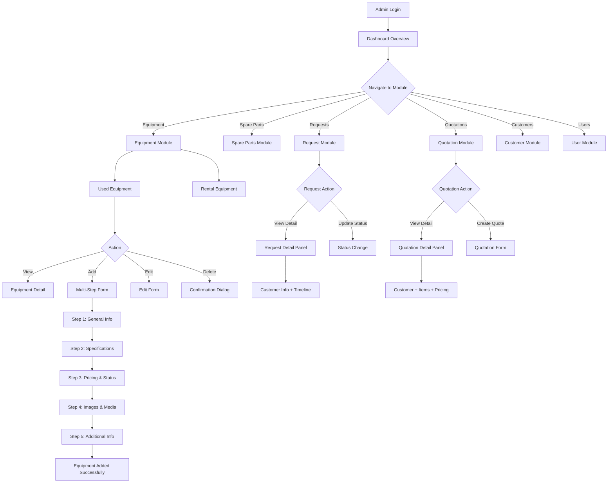

# PRD — GTI Admin Panel Dashboard

## 1. Product Overview

### 1.1 One-Line Positioning
> GTI Admin Panel adalah **WordPress-based admin dashboard** untuk PT Global Tractors Indonesia, yang menyatukan manajemen equipment, spare parts, quotation, dan customer dalam satu platform terpusat — dengan custom design system yang menggantikan default WordPress admin styling.

### 1.2 Product Form
- **Current Selection**: WordPress Theme (Custom Admin Panel)
- **Platform**: WordPress (PHP) — tetap menggunakan CMS yang sudah ada
- **Location**: `wp-content/themes/global-tractors/`
- **Rationale**: Admin panel dibangun sebagai bagian dari theme WordPress yang sudah ada, memanfaatkan infrastructure WordPress (authentication, database, media library)
- **Design System**: Custom admin CSS dengan dark navy sidebar, GTI Yellow primary accent, dan white/light gray content area — menggantikan default WordPress admin styling

### 1.3 Target Users
| User Type | Description | Primary Need |
|-----------|-------------|--------------|
| Super Admin | Full system access, manages all modules | Complete control over all data and settings |
| Admin / Inventory | Manages equipment and spare parts | CRUD operations, stock monitoring |
| Sales | Manages quotations and customer interactions | Quotation creation, customer follow-up |

### 1.4 Core Value
- **Unified Management**: All business data (equipment, spare parts, customers, quotations) in one dashboard
- **Visual Recognition**: Equipment thumbnails directly in tables for instant visual identification
- **Status-Driven Workflow**: Color-coded status badges enable at-a-glance business state monitoring
- **Consistent UX**: Shared design system across all modules eliminates learning curve

---

## 2. Target Users & Use Scenarios

### 2.1 User Personas

**Persona 1: Super Admin**
- Role: System administrator with full access
- Daily tasks: Overview dashboard, user management, system configuration
- Pain points: Scattered data across multiple tools, no unified view

**Persona 2: Inventory Manager**
- Role: Manages equipment and spare parts inventory
- Daily tasks: Add/edit equipment, monitor stock levels, process equipment requests
- Pain points: Difficulty tracking equipment status, manual stock monitoring

**Persona 3: Sales Representative**
- Role: Manages customer quotations and relationships
- Daily tasks: Create quotations, follow up with customers, track quotation status
- Pain points: Lost quotation tracking, no visibility into pipeline status

### 2.2 Use Scenarios

**Scenario 1: Equipment Management**
> Admin opens dashboard → sees equipment overview → navigates to Used Equipment → filters by category/brand/status → adds new equipment via multi-step form → uploads images → sets pricing → equipment appears in list

**Scenario 2: Quotation Processing**
> Sales receives request → opens Request Quotation → sees new quotation in queue → opens detail → reviews customer info and requested items → creates quotation with pricing → sends to customer → tracks status until approved/completed

**Scenario 3: Stock Monitoring**
> Inventory manager opens Spare Parts → sees low stock alerts in statistics cards → filters by stock status → identifies items needing reorder → updates stock quantities

---

## 3. Core User Flow



---

## 4. Feature List

```
GTI Admin Panel
├── 🔴 Dashboard
│   ├── Summary Cards (Used Equipment, Rental Active, Spare Parts, Requests, Quotations, etc.)
│   ├── Request Overview Chart
│   ├── Recent Activity Feed
│   └── Latest Data Table
│
├── 🔴 Equipment Management
│   ├── 🔴 Used Equipment
│   │   ├── Statistics Cards (Total, Available, Sold, Maintenance)
│   │   ├── Filter Bar (Search, Category, Brand, Condition, Status)
│   │   ├── Equipment Table with Thumbnails
│   │   ├── Multi-Step Add/Edit Form
│   │   └── Equipment Detail View
│   │
│   └── 🔴 Rental Equipment
│       ├── Statistics Cards (Total, Available, Rented, Reserved)
│       ├── Filter Bar (Search, Category, Brand, Availability)
│       ├── Equipment Table with Thumbnails
│       ├── Add/Edit Form
│       └── Rental Detail View
│
├── 🔴 Spare Parts Management
│   ├── Statistics Cards (Total, In Stock, Low Stock, Out of Stock, Inventory Value)
│   ├── Filter Bar (Search, Category, Brand, Supplier, Stock Status)
│   ├── Spare Parts Table with Thumbnails
│   ├── Add/Edit Form
│   └── Stock Status Indicators
│
├── 🔴 Request Equipment
│   ├── Statistics Cards (All, New, Processing, Proposal Sent, Closed)
│   ├── Filter Bar (Search, Status, Brand, Category, Location, Date Range)
│   ├── Request Table
│   ├── Request Detail Panel (Customer Info + Request Info + Timeline)
│   └── Status Management
│
├── 🔴 Request Quotation
│   ├── Statistics Cards (New, Processing, Waiting Customer, Approved, Rejected, Completed)
│   ├── Filter Bar (Search, Status, Brand, PIC)
│   ├── Quotation Table
│   ├── Quotation Detail Panel Right Drawer (like menu request equipment)
│   └── Quotation Status Management
│
├── 🟡 Sell Equipment
│   ├── Statistics Cards
│   ├── Filter Bar
│   ├── Sell Request Table
│   └── Sell Detail View
│
├── 🟡 Contact Messages (don't make it)
│   ├── Message List
│   ├── Message Detail
│   └── Status Management
│
├── 🔴 Customers
│   ├── Statistics Cards (Total, Active, New)
│   ├── Customer Table
│   └── Customer Detail Dashboard (Mini CRM Profile)
│       ├── Customer Header (Avatar, Name, Company, Status)
│       ├── Overview Cards (Requests, Quotations, Equipment, Total Value)
│       ├── Contact & Company Info Cards
│       └── Activity Timeline
│
└── 🔴 Users
    ├── Statistics Cards (Total, Active, Inactive, Administrators)
    ├── User Table
    └── Add/Edit User Form
        ├── Profile Photo Upload
        ├── Personal Information Fields
        ├── Role Selection
        └── Permission Configuration
```

**Priority Legend:**
- 🔴 Core — MVP Must Have
- 🟡 Important — Phase 2
- ⚪ Future — Not in current scope

---

## 5. Key Page Layout Wireframe

### 5.1 Main Admin Layout (All Pages)

```
┌──────────────────────────────────────────────────────────────────────┐
│                    Header (Breadcrumb + Profile)                      │
├────────────┬─────────────────────────────────────────────────────────┤
│            │                                                         │
│            │  Page Title + Action Buttons                             │
│            │                                                         │
│  SIDEBAR   ├─────────────────────────────────────────────────────────┤
│            │                                                         │
│  [Logo]    │  Content Area                                           │
│            │                                                         │
│  ● Dashboard│  (Statistics / Tables / Forms / Details)               │
│            │                                                         │
│  Equipment │  ← Visual Center of Gravity                             │
│   ├ Used   │                                                         │
│   └ Rental │                                                         │
│            ├─────────────────────────────────────────────────────────┤
│  Spare Parts│  Pagination / Footer                                    │
│            │                                                         │
│  Requests  │                                                         │
│  Quotation │                                                         │
│  Sell Eq.  │                                                         │
│  Contacts  │                                                         │
│  Customers │                                                         │
│  Users     │                                                         │
│            │                                                         │
├────────────┤                                                         │
│  Admin     │                                                         │
│  Profile   │                                                         │
└────────────┴─────────────────────────────────────────────────────────┘

Visual Rules:
- Sidebar: Dark navy background (#1a1f36 or similar)
- Active Menu: GTI Yellow background
- Content Area: White / very light gray
- Cards: Thin border, rounded corners
- Primary Accent: GTI Yellow
```

### 5.2 Dashboard Page

```
┌──────────────────────────────────────────────────────────────────────┐
│  Dashboard                                                          │
├──────────────────────────────────────────────────────────────────────┤
│                                                                      │
│  ┌──────────┐ ┌──────────┐ ┌──────────┐ ┌──────────┐ ┌──────────┐ │
│  │ Used Eq. │ │Rental Eq.│ │Spare Parts│ │ Requests │ │Quotations│ │
│  │   124    │ │    45    │ │    372   │ │    28    │ │    15    │ │
│  └──────────┘ └──────────┘ └──────────┘ └──────────┘ └──────────┘ │
│                                                                      │
│  ┌─────────────────────────────┐  ┌─────────────────────────────┐  │
│  │     Request Overview        │  │     Recent Activity          │  │
│  │        [Chart]              │  │  • New request from PT...    │  │
│  │                             │  │  • Quotation approved...     │  │
│  │                             │  │  • Equipment updated...      │  │
│  └─────────────────────────────┘  └─────────────────────────────┘  │
│                                                                      │
│  ┌──────────────────────────────────────────────────────────────┐  │
│  │  Latest Equipment / Requests                                  │  │
│  │  [Mini Table: ID | Name | Status | Date]                      │  │
│  └──────────────────────────────────────────────────────────────┘  │
│                                                                      │
└──────────────────────────────────────────────────────────────────────┘
```

### 5.3 Equipment List Page (Used & Rental)

```
┌──────────────────────────────────────────────────────────────────────┐
│  Used Equipment                                    [+ Add Equipment] │
├──────────────────────────────────────────────────────────────────────┤
│                                                                      │
│  ┌────────┐ ┌────────┐ ┌────────┐ ┌────────┐                       │
│  │ Total  │ │Avail.  │ │  Sold  │ │ Maint. │                       │
│  │  124   │ │   89   │ │   31   │ │    4   │                       │
│  └────────┘ └────────┘ └────────┘ └────────┘                       │
│                                                                      │
│  [Search Equipment........] [Category▾] [Brand▾] [Condition▾] [Status▾] │
│                                                                      │
│  ┌──────┬───────────────┬─────────┬──────┬───────────┬─────────┬────────┐ │
│  │Image │ Equipment     │ Brand   │ Year │ Condition │ Status  │ Action │ │
│  ├──────┼───────────────┼─────────┼──────┼───────────┼─────────┼────────┤ │
│  │ [IMG]│ Komatsu PC200 │ Komatsu │ 2020 │ Excellent │Available│  •••   │ │
│  │ [IMG]│ Hitachi Zaxis │ Hitachi │ 2019 │ Good      │Available│  •••   │ │
│  │ [IMG]│ CAT 320D2     │ CAT     │ 2018 │ Good      │Sold     │  •••   │ │
│  └──────┴───────────────┴─────────┴──────┴───────────┴─────────┴────────┘ │
│                                                                      │
│  Showing 1-10 of 124  < 1 2 3 ... 13 >                               │
│                                                                      │
└──────────────────────────────────────────────────────────────────────┘
```

### 5.4 Equipment Add/Edit (Multi-Step Form)

```
┌──────────────────────────────────────────────────────────────────────┐
│  Add New Equipment                                                   │
├──────────────────────────────────────────────────────────────────────┤
│                                                                      │
│  Step 1 ──── Step 2 ──── Step 3 ──── Step 4 ──── Step 5            │
│  General     Specs       Pricing      Images      Additional         │
│  Info                    & Status     & Media     Info               │
│                                                                      │
│  ┌──────────────────────────────────────────────────────────────┐  │
│  │  Step 1: General Information                                   │  │
│  │                                                                │  │
│  │  Equipment Name: [____________________]                        │  │
│  │  Equipment Code: [____________________]                        │  │
│  │  Category:       [Select Category    ▾]                        │  │
│  │  Brand:          [Select Brand       ▾]                        │  │
│  │  Model:          [____________________]                        │  │
│  │  Year:           [____]                                         │  │
│  │  Location:       [____________________]                        │  │
│  │  Description:    [____________________]                        │  │
│  │                    [____________________]                        │  │
│  └──────────────────────────────────────────────────────────────┘  │
│                                                                      │
│                                              [ Cancel ] [ Next → ]  │
│                                                                      │
└──────────────────────────────────────────────────────────────────────┘
```

### 5.5 Request Quotation Detail

```
┌──────────────────────────────────────────────────────────────────────┐
│  Quotation RFQ-2405-0012                           [Processing]     │
├──────────────────────────────────────────────────────────────────────┤
│                                                                      │
│  ┌──────────────────────────┐  ┌──────────────────────────────┐    │
│  │  Customer Information     │  │  Request Information          │    │
│  │                           │  │                                │    │
│  │  PT Abadi Sentosa         │  │  Requested Date: 2024-05-15   │    │
│  │  Contact: Budi Santoso    │  │  Valid Until:    2024-06-15   │    │
│  │  Email: budi@abadi.co.id  │  │  Delivery:       Balikpapan   │    │
│  │  Phone: +62 812xxxxxxx    │  │  Notes: [___]                  │    │
│  └──────────────────────────┘  └──────────────────────────────┘    │
│                                                                      │
│  ┌──────────────────────────────────────────────────────────────┐  │
│  │  Quotation Items                                               │  │
│  │  ┌───────────────────┬──────┬──────────┬──────────┐           │  │
│  │  │ Item              │ Qty  │Unit Price│  Total   │           │  │
│  │  ├───────────────────┼──────┼──────────┼──────────┤           │  │
│  │  │ Komatsu PC200-8   │  2   │Rp 850 jt │Rp 1.700jt│          │  │
│  │  └───────────────────┴──────┴──────────┴──────────┘           │  │
│  │                                           Subtotal: Rp 1.700jt│  │
│  │                                           Discount: (5%)      │  │
│  │                                           Tax (11%):          │  │
│  │                                           TOTAL: Rp 1.823jt   │  │
│  └──────────────────────────────────────────────────────────────┘  │
│                                                                      │
│  Status Timeline:                                                    │
│  ● New → ● Processing → ○ Waiting Customer → ○ Approved → ○ Done   │
│                                                                      │
└──────────────────────────────────────────────────────────────────────┘
```

---

## 6. Detailed Feature Descriptions

### 6.1 Dashboard

**Description**: Main overview page showing business health metrics and recent activity.

**Trigger**: User logs in or clicks "Dashboard" in sidebar.

**Components**:

| Component | Description | Data Source |
|-----------|-------------|-------------|
| Summary Cards | 7-8 metric cards showing key counts | Aggregated from all modules |
| Request Overview Chart | Bar/line chart showing request trends | Request Equipment data |
| Recent Activity | Last 5-10 system activities | Activity log |
| Latest Data Table | Most recent equipment/requests | Latest entries from modules |

**Interaction Details**:

| Scenario | Behavior |
|----------|----------|
| Page Load | Show skeleton loading → render data |
| No Data | Show empty state with "Start by adding your first equipment" |
| Chart Hover | Show tooltip with exact values |
| Card Click | Navigate to corresponding module |

**Data Refresh**: Auto-refresh every 5 minutes or manual refresh button.

---

### 6.2 Used Equipment

**Description**: Manages equipment available for sale with full CRUD operations.

**Trigger**: Click "Used Equipment" in sidebar under Equipment menu.

#### 6.2.1 Equipment List

**Filter Options**:

| Filter | Type | Options |
|--------|------|---------|
| Search | Text Input | Equipment name, code, brand |
| Category | Dropdown | Excavator, Bulldozer, Wheel Loader, etc. |
| Brand | Dropdown | Komatsu, CAT, Hitachi, Volvo, etc. |
| Condition | Dropdown | Excellent, Good, Fair, Poor |
| Status | Dropdown | Available, Sold, Reserved, Maintenance |
| Year | Range | Min-Max year |
| Location | Dropdown | Jakarta, Balikpapan, Surabaya, etc. |

**Table Columns**:

| Column | Width | Description |
|--------|-------|-------------|
| Image | 80px | Equipment thumbnail |
| Equipment | auto | Code + Name |
| Brand | 100px | Brand name |
| Model | 100px | Model designation |
| Year | 60px | Manufacturing year |
| Condition | 100px | Current condition |
| Status | 100px | Status badge |
| Price | 120px | Selling price (Rp) |
| Action | 60px | Three-dot menu |

**Status Badges**:

| Status | Color | Meaning |
|--------|-------|---------|
| Available | Green | Ready for sale |
| Sold | Red | Already sold |
| Reserved | Yellow | Reserved by customer |
| Maintenance | Orange | Under maintenance |

#### 6.2.2 Add/Edit Equipment (Multi-Step Form)

**Step 1: General Information**

| Field | Type | Required | Validation |
|-------|------|----------|------------|
| Equipment Name | Text | Yes | Max 100 chars |
| Equipment Code | Text | Yes | Auto-generated or manual, unique |
| Category | Dropdown | Yes | Select from predefined list |
| Brand | Dropdown | Yes | Select from predefined list |
| Model | Text | Yes | Max 50 chars |
| Year | Number | Yes | 1900-current year |
| Location | Dropdown | Yes | Select from predefined list |
| Description | Textarea | No | Max 500 chars |

**Step 2: Specifications**

| Field | Type | Required |
|-------|------|----------|
| Engine Type | Text | No |
| Operating Weight | Number | No |
| Power (HP) | Number | No |
| Hours | Number | No |
| Dimensions | Text | No |
| Fuel Type | Dropdown | No |
| Additional Specs | Dynamic fields | No |

**Step 3: Pricing & Status**

| Field | Type | Required |
|-------|------|----------|
| Price (Rp) | Number | Yes |
| Currency | Dropdown | IDR (default) |
| Condition | Dropdown | Yes |
| Status | Dropdown | Yes |
| Negotiable | Checkbox | No |
| Warranty Info | Text | No |

**Step 4: Images & Media**

| Field | Type | Required |
|-------|------|----------|
| Main Image | File Upload | Yes |
| Gallery Images | Multiple Upload | No |
| Video URL | URL | No |

Constraints:
- Max file size: 5MB per image
- Accepted formats: JPG, PNG, WebP
- Max gallery images: 10

**Step 5: Additional Information**

| Field | Type | Required |
|-------|------|----------|
| Registration Number | Text | No |
| Insurance Status | Dropdown | No |
| Last Service Date | Date | No |
| Next Service Due | Date | No |
| Notes | Textarea | No |
| Tags | Multi-select | No |

---

### 6.3 Rental Equipment

**Description**: Manages equipment available for rent.

**Trigger**: Click "Rental Equipment" in sidebar under Equipment menu.

**Differences from Used Equipment**:

| Aspect | Used Equipment | Rental Equipment |
|--------|---------------|------------------|
| Price Field | Selling Price | Rental Price (Rp/month) |
| Status Options | Available, Sold, Reserved, Maintenance | Available, Rented, Reserved, Maintenance |
| Additional Fields | — | Rental Period, Min Rental Duration |
| Table Highlight | Price | Rental Price + Availability |

**Rental-Specific Fields**:

| Field | Type | Required |
|-------|------|----------|
| Rental Price (Rp/month) | Number | Yes |
| Min Rental Period | Number | Yes (months) |
| Security Deposit | Number | No |
| Rental Terms | Textarea | No |

---

### 6.4 Spare Parts

**Description**: Manages spare parts inventory with stock tracking.

**Trigger**: Click "Spare Parts" in sidebar.

#### 6.4.1 Statistics Cards

| Card | Metric | Color |
|------|--------|-------|
| Total Parts | Sum of all parts | Blue |
| In Stock | Stock > 10 | Green |
| Low Stock | Stock 1-10 | Yellow |
| Out of Stock | Stock = 0 | Red |
| Inventory Value | Sum(Price × Stock) | Purple |

#### 6.4.2 Table Columns

| Column | Description |
|--------|-------------|
| Image | Part thumbnail |
| Part Number | Unique identifier |
| Part Name | Descriptive name |
| Category | Part category |
| Brand | Compatible brand |
| Stock | Current quantity |
| Unit Price | Price per unit (Rp) |
| Total Value | Stock × Unit Price |
| Status | Stock status badge |
| Action | Three-dot menu |

**Stock Status Indicators**:

| Status | Badge | Condition |
|--------|-------|-----------|
| In Stock | 🟢 Green | Stock > 10 |
| Low Stock | 🟡 Yellow | Stock 1-10 |
| Out of Stock | 🔴 Red | Stock = 0 |

---

### 6.5 Request Equipment

**Description**: Handles incoming equipment requests from customers.

**Trigger**: Click "Request Equipment" in sidebar.

#### 6.5.1 Statistics Cards

| Card | Metric |
|------|--------|
| All Requests | Total count |
| New | Status = New |
| Processing | Status = Processing |
| Proposal Sent | Status = Proposal Sent |
| Closed | Status = Closed |

#### 6.5.2 Table Columns

| Column | Description |
|--------|-------------|
| Request ID | Format: REQ-YYMM-XXXX |
| Customer | Customer name/company |
| Requested Equipment | Equipment details |
| Quantity | Number of units |
| Location | Delivery location |
| Budget | Budget range (if provided) |
| Status | Status badge |
| Request Date | Submission date |
| Action | Three-dot menu |

#### 6.5.3 Request Detail Panel

**Left Section - Request Information**:

| Field | Description |
|-------|-------------|
| Request ID | Unique identifier |
| Equipment | Requested equipment |
| Brand | Preferred brand |
| Quantity | Number of units |
| Location | Delivery location |
| Required Date | When needed |
| Notes | Additional requirements |
| Request Date | When submitted |

**Right Section - Customer Information**:

| Field | Description |
|-------|-------------|
| Customer Name | Contact person |
| Company | Company name |
| Email | Contact email |
| Phone | Contact phone |
| Location | Customer location |

**Status Timeline**:
```
New → Processing → Proposal Sent → Closed
```

---

### 6.6 Request Quotation

**Description**: Manages quotation requests and creation.

**Trigger**: Click "Request Quotation" in sidebar.

#### 6.6.1 Statistics Cards

| Card | Status | Color |
|------|--------|-------|
| New | New request | Blue |
| Processing | Being processed | Yellow |
| Waiting Customer | Awaiting response | Orange |
| Approved | Customer approved | Green |
| Rejected | Customer rejected | Red |
| Completed | Fully processed | Gray |

#### 6.6.2 Table Columns

| Column | Description |
|--------|-------------|
| Quotation ID | Format: RFQ-YYMM-XXXX |
| Customer | Customer name |
| Company | Company name |
| Requested Items | Equipment requested |
| Sales PIC | Assigned sales person |
| Status | Status badge |
| Date | Request date |
| Action | Three-dot menu |

#### 6.6.3 Quotation Detail

**Customer Information**:

| Field | Description |
|-------|-------------|
| Customer Name | Contact person |
| Company | Company name |
| Email | Contact email |
| Phone | Contact phone |
| Address | Full address |

**Request Information**:

| Field | Description |
|-------|-------------|
| Requested Date | When request was made |
| Valid Until | Quotation validity |
| Delivery Location | Where to deliver |
| Additional Notes | Special requirements |

**Quotation Items Table**:

| Column | Description |
|--------|-------------|
| Item | Equipment/part name |
| Quantity | Number of units |
| Unit Price | Price per unit |
| Total | Quantity × Unit Price |

**Pricing Summary**:

| Field | Calculation |
|-------|-------------|
| Subtotal | Sum of all items |
| Discount | Discount amount/% |
| Tax (11%) | PPN calculation |
| Total | Final amount |

---

### 6.7 Customers

**Description**: Customer management with mini CRM profile view.

**Trigger**: Click "Customers" in sidebar.

#### 6.7.1 Customer Table

| Column | Description |
|--------|-------------|
| Customer ID | Unique identifier |
| Name | Customer name |
| Company | Company name |
| Email | Contact email |
| Phone | Contact phone |
| Industry | Business industry |
| Location | City/region |
| Status | Active/Inactive |
| Registered Date | When registered |
| Action | Three-dot menu |

#### 6.7.2 Customer Detail Dashboard

**Header Section**:

| Element | Description |
|---------|-------------|
| Avatar/Initials | Customer representation |
| Customer Name | Full name |
| Company | Company name |
| Status Badge | Active/Inactive |
| Customer ID | Unique identifier |
| Edit Button | "Edit Customer" |

**Overview Cards**:

| Card | Metric |
|------|--------|
| Requests | Total equipment requests |
| Quotations | Total quotations |
| Equipment | Equipment purchased/rented |
| Total Value | Total business value |

**Information Cards**:

| Card | Fields |
|------|--------|
| Contact Information | Email, Phone, Address |
| Company Information | Company, Industry, Location |
| Activity | Last activities timeline |

**Activity Timeline**:
```
- Requested Komatsu PC200-8 (2 days ago)
- Submitted quotation request (5 days ago)
- Updated contact information (1 week ago)
- Sent inquiry (2 weeks ago)
```

---

### 6.8 Users

**Description**: User management for admin panel access.

**Trigger**: Click "Users" in sidebar.

#### 6.8.1 User Table

| Column | Description |
|--------|-------------|
| User | Name + Avatar |
| Email | Contact email |
| Role | User role |
| Status | Active/Inactive |
| Action | Three-dot menu |

**Role Options**:

| Role | Description |
|------|-------------|
| Super Admin | Full system access |
| Admin | General administration |
| Sales | Quotation & customer management |
| Inventory | Equipment & spare parts management |

#### 6.8.2 Add/Edit User Form

| Field | Type | Required |
|-------|------|----------|
| Profile Photo | File Upload | No |
| Full Name | Text | Yes |
| Email | Email | Yes |
| Phone | Text | No |
| Password | Password | Yes (on create) |
| Role | Dropdown | Yes |
| Department | Dropdown | No |
| Status | Dropdown | Yes |

**Permission Matrix**:

| Module | Super Admin | Admin | Sales | Inventory |
|--------|-------------|-------|-------|------------|
| Dashboard | ✅ Full | ✅ Full | ✅ View | ✅ View |
| Used Equipment | ✅ CRUD | ✅ CRUD | 👁 View | ✅ CRUD |
| Rental Equipment | ✅ CRUD | ✅ CRUD | 👁 View | ✅ CRUD |
| Spare Parts | ✅ CRUD | ✅ CRUD | ❌ No Access | ✅ CRUD |
| Request Equipment | ✅ Full | ✅ Full | ✅ Full | 👁 View |
| Request Quotation | ✅ Full | ✅ Full | ✅ Full | ❌ No Access |
| Sell Equipment | ✅ Full | ✅ Full | ✅ Full | ❌ No Access |
| Contact Messages | ✅ Full | ✅ Full | ✅ View | ❌ No Access |
| Customers | ✅ CRUD | 👁 View | ✅ Full | ❌ No Access |
| Users | ✅ CRUD | ❌ No Access | ❌ No Access | ❌ No Access |

---

### 6.9 Sell Equipment

**Description**: Manages equipment sell submissions from customers.

**Trigger**: Click "Sell Equipment" in sidebar.

#### 6.9.1 Table Columns

| Column | Description |
|--------|-------------|
| Submission ID | Unique identifier |
| Customer | Customer name |
| Equipment | Equipment details |
| Offered Price | Customer's offered price |
| Status | Status badge |
| Submission Date | When submitted |
| Action | Three-dot menu |

#### 6.9.2 Detail View

| Section | Fields |
|---------|--------|
| Customer Info | Name, Company, Email, Phone |
| Equipment Info | Name, Brand, Model, Year, Condition, Hours |
| Offer Details | Offered Price, Negotiation Notes, Status |
| Images | Equipment photos uploaded by customer |

---

### 6.10 Contact Messages

**Description**: Manages incoming contact form messages.

**Trigger**: Click "Contact Messages" in sidebar.

#### 6.10.1 Table Columns

| Column | Description |
|--------|-------------|
| ID | Message ID |
| From | Sender name |
| Email | Sender email |
| Subject | Message subject |
| Status | Read/Unread |
| Date | Received date |
| Action | Three-dot menu |

---

## 7. Design System

### 7.1 Color Palette

| Color Name | Usage | Hex Code |
|------------|-------|----------|
| GTI Yellow | Primary accent, active menu, CTA buttons, important highlights | #F5A623 (approx) |
| Dark Navy | Sidebar background, primary text | #1a1f36 |
| White | Content area background, card backgrounds | #FFFFFF |
| Light Gray | Secondary background, borders | #F3F4F6 |
| Dark Gray | Body text | #374151 |

### 7.2 Status Colors

| Status | Color | Hex |
|--------|-------|-----|
| Success/Available/Approved | Green | #10B981 |
| Warning/Low Stock/Reserved | Yellow | #F59E0B |
| Error/Sold/Rejected | Red | #EF4444 |
| Processing | Blue | #3B82F6 |
| Neutral/Completed | Gray | #6B7280 |

### 7.3 Typography

| Element | Size | Weight |
|---------|------|--------|
| Page Title | 24px | Bold |
| Section Title | 18px | Semi-bold |
| Card Title | 14px | Semi-bold |
| Body Text | 14px | Regular |
| Small/Label | 12px | Regular |

### 7.4 Component Specifications

| Component | Properties |
|-----------|------------|
| Card | border-radius: 8px, border: 1px solid #E5E7EB, padding: 16px |
| Button Primary | background: GTI Yellow, text: Dark Navy, border-radius: 6px |
| Button Secondary | background: White, border: 1px solid #D1D5DB, border-radius: 6px |
| Status Badge | border-radius: 12px, padding: 2px 8px, font-size: 12px |
| Table Header | background: #F9FAFB, font-weight: 600 |
| Table Row Hover | background: #F9FAFB |
| Input Field | border: 1px solid #D1D5DB, border-radius: 6px, padding: 8px 12px |

### 7.5 Sidebar Specification

```
┌──────────────────────────┐
│ GTI LOGO (48px height)   │
├──────────────────────────┤
│                          │
│ ● Dashboard              │  ← Active: Yellow background
│                          │
│ Equipment           ›    │  ← Expandable
│   Used Equipment         │
│   Rental Equipment       │
│                          │
│ Spare Parts              │
│                          │
│ Request Equipment        │
│ Request Quotation        │
│                          │
│ Sell Equipment           │
│ Contact Messages         │
│                          │
│ Customers                │
│ Users                    │
│                          │
├──────────────────────────┤
│ [Avatar] Admin Name      │
│ Role: Super Admin        │
└──────────────────────────┘

Width: 260px (expanded) / 64px (collapsed)
Background: Dark Navy
Text: White/Gray
Active: GTI Yellow background with dark text
```

---

## 8. Interaction Patterns

### 8.1 Common Interactions

| Pattern | Implementation |
|---------|----------------|
| Add New | Yellow button "Add New [Item]" → opens form (modal or full page) |
| Edit | Three-dot menu → Edit → opens form pre-filled |
| Delete | Three-dot menu → Delete → confirmation dialog |
| View Detail | Click row or View button → detail panel/page |
| Filter | Filter bar with dropdowns and search input |
| Reset | "Reset Filter" button clears all filters |
| Pagination | Bottom of table, shows "Showing X-Y of Z" |

### 8.2 Multi-Step Form Pattern

| Step | Behavior |
|------|----------|
| Navigation | Horizontal stepper at top, clickable steps |
| Validation | Validate current step before allowing next |
| Progress | Save partial progress, allow going back |
| Submit | Final step shows summary before submit |
| Cancel | Confirmation dialog if data entered |

### 8.3 Action Menu (Three-Dot)

```
[•••]
├── View Details
├── Edit
├── Duplicate
├── Change Status
└── Delete
```

### 8.4 Confirmation Dialogs

| Action | Dialog Content |
|--------|----------------|
| Delete | "Are you sure you want to delete [Item]? This action cannot be undone." |
| Status Change | "Change status from [Current] to [New]?" |
| Discard Changes | "You have unsaved changes. Are you sure you want to leave?" |

### 8.5 Toast Notifications

| Type | Color | Duration |
|------|-------|----------|
| Success | Green | 3 seconds |
| Error | Red | 5 seconds |
| Warning | Yellow | 4 seconds |
| Info | Blue | 3 seconds |

---

## 9. Data Models

### 9.1 Database Schema (MySQL)

#### Equipment Table
```sql
CREATE TABLE wp_gti_equipment (
    id BIGINT UNSIGNED AUTO_INCREMENT PRIMARY KEY,
    equipment_code VARCHAR(50) UNIQUE NOT NULL,
    name VARCHAR(255) NOT NULL,
    type ENUM('used', 'rental') NOT NULL,
    category VARCHAR(100),
    brand VARCHAR(100),
    model VARCHAR(100),
    year INT,
    condition_status VARCHAR(50),
    status VARCHAR(50) DEFAULT 'available',
    price DECIMAL(15,2),
    price_type ENUM('sale', 'monthly_rental'),
    location VARCHAR(255),
    description TEXT,
    specifications JSON,
    images JSON,
    main_image VARCHAR(500),
    hours INT,
    negotiable TINYINT(1) DEFAULT 0,
    warranty_info TEXT,
    registration_number VARCHAR(100),
    insurance_status VARCHAR(50),
    last_service_date DATE,
    next_service_due DATE,
    notes TEXT,
    created_by BIGINT UNSIGNED,
    created_at DATETIME DEFAULT CURRENT_TIMESTAMP,
    updated_at DATETIME DEFAULT CURRENT_TIMESTAMP ON UPDATE CURRENT_TIMESTAMP,
    deleted_at DATETIME NULL
);
```

#### Spare Parts Table
```sql
CREATE TABLE wp_gti_spare_parts (
    id BIGINT UNSIGNED AUTO_INCREMENT PRIMARY KEY,
    part_number VARCHAR(100) UNIQUE NOT NULL,
    name VARCHAR(255) NOT NULL,
    category VARCHAR(100),
    brand VARCHAR(100),
    description TEXT,
    stock INT DEFAULT 0,
    minimum_stock INT DEFAULT 10,
    unit_price DECIMAL(15,2),
    supplier VARCHAR(255),
    location VARCHAR(255),
    image VARCHAR(500),
    status VARCHAR(50) DEFAULT 'in_stock',
    created_at DATETIME DEFAULT CURRENT_TIMESTAMP,
    updated_at DATETIME DEFAULT CURRENT_TIMESTAMP ON UPDATE CURRENT_TIMESTAMP
);
```

#### Requests Table
```sql
CREATE TABLE wp_gti_requests (
    id BIGINT UNSIGNED AUTO_INCREMENT PRIMARY KEY,
    request_id VARCHAR(20) UNIQUE NOT NULL,
    customer_name VARCHAR(255),
    customer_company VARCHAR(255),
    customer_email VARCHAR(255),
    customer_phone VARCHAR(50),
    customer_location VARCHAR(255),
    equipment VARCHAR(255),
    brand VARCHAR(100),
    quantity INT DEFAULT 1,
    location VARCHAR(255),
    budget DECIMAL(15,2),
    required_date DATE,
    notes TEXT,
    status VARCHAR(50) DEFAULT 'new',
    request_date DATE,
    created_at DATETIME DEFAULT CURRENT_TIMESTAMP,
    updated_at DATETIME DEFAULT CURRENT_TIMESTAMP ON UPDATE CURRENT_TIMESTAMP
);
```

#### Quotations Table
```sql
CREATE TABLE wp_gti_quotations (
    id BIGINT UNSIGNED AUTO_INCREMENT PRIMARY KEY,
    quotation_id VARCHAR(20) UNIQUE NOT NULL,
    customer_name VARCHAR(255),
    customer_company VARCHAR(255),
    customer_email VARCHAR(255),
    customer_phone VARCHAR(50),
    customer_address TEXT,
    items JSON,
    subtotal DECIMAL(15,2),
    discount DECIMAL(15,2) DEFAULT 0,
    discount_type ENUM('amount', 'percentage') DEFAULT 'amount',
    tax_rate DECIMAL(5,2) DEFAULT 11.00,
    tax_amount DECIMAL(15,2),
    total DECIMAL(15,2),
    sales_pic VARCHAR(255),
    valid_until DATE,
    delivery_location VARCHAR(255),
    additional_notes TEXT,
    status VARCHAR(50) DEFAULT 'new',
    request_date DATE,
    created_at DATETIME DEFAULT CURRENT_TIMESTAMP,
    updated_at DATETIME DEFAULT CURRENT_TIMESTAMP ON UPDATE CURRENT_TIMESTAMP
);
```

#### Customers Table
```sql
CREATE TABLE wp_gti_customers (
    id BIGINT UNSIGNED AUTO_INCREMENT PRIMARY KEY,
    customer_id VARCHAR(20) UNIQUE NOT NULL,
    name VARCHAR(255) NOT NULL,
    company VARCHAR(255),
    email VARCHAR(255),
    phone VARCHAR(50),
    address TEXT,
    industry VARCHAR(100),
    location VARCHAR(255),
    status VARCHAR(50) DEFAULT 'active',
    registered_date DATE,
    created_at DATETIME DEFAULT CURRENT_TIMESTAMP,
    updated_at DATETIME DEFAULT CURRENT_TIMESTAMP ON UPDATE CURRENT_TIMESTAMP
);
```

#### Sell Equipment Requests Table
```sql
CREATE TABLE wp_gti_sell_requests (
    id BIGINT UNSIGNED AUTO_INCREMENT PRIMARY KEY,
    customer_name VARCHAR(255),
    customer_company VARCHAR(255),
    customer_email VARCHAR(255),
    customer_phone VARCHAR(50),
    equipment_name VARCHAR(255),
    equipment_brand VARCHAR(100),
    equipment_model VARCHAR(100),
    equipment_year INT,
    equipment_condition VARCHAR(50),
    equipment_hours INT,
    offered_price DECIMAL(15,2),
    images JSON,
    status VARCHAR(50) DEFAULT 'new',
    created_at DATETIME DEFAULT CURRENT_TIMESTAMP,
    updated_at DATETIME DEFAULT CURRENT_TIMESTAMP ON UPDATE CURRENT_TIMESTAMP
);
```

#### Contact Messages Table
```sql
CREATE TABLE wp_gti_messages (
    id BIGINT UNSIGNED AUTO_INCREMENT PRIMARY KEY,
    sender_name VARCHAR(255),
    sender_email VARCHAR(255),
    subject VARCHAR(255),
    message TEXT,
    status VARCHAR(50) DEFAULT 'unread',
    created_at DATETIME DEFAULT CURRENT_TIMESTAMP
);
```

#### Activity Log Table
```sql
CREATE TABLE wp_gti_activity_log (
    id BIGINT UNSIGNED AUTO_INCREMENT PRIMARY KEY,
    user_id BIGINT UNSIGNED,
    action VARCHAR(100),
    entity_type VARCHAR(50),
    entity_id BIGINT UNSIGNED,
    details JSON,
    created_at DATETIME DEFAULT CURRENT_TIMESTAMP
);
```

### 9.2 PHP Data Access Example

```php
// class-gti-database.php

class GTI_Database {
    private $wpdb;
    
    public function __construct() {
        global $wpdb;
        $this->wpdb = $wpdb;
        $this->wpdb->prefix = 'gti_'; // Custom prefix for GTI tables
    }
    
    // Get all equipment with filters
    public function get_equipment($filters = []) {
        $table = $this->wpdb->prefix . 'equipment';
        $where = "WHERE deleted_at IS NULL";
        
        if (!empty($filters['type'])) {
            $where .= $this->wpdb->prepare(" AND type = %s", $filters['type']);
        }
        
        if (!empty($filters['status'])) {
            $where .= $this->wpdb->prepare(" AND status = %s", $filters['status']);
        }
        
        return $this->wpdb->get_results("SELECT * FROM {$table} {$where} ORDER BY created_at DESC");
    }
    
    // Insert new equipment
    public function insert_equipment($data) {
        $table = $this->wpdb->prefix . 'equipment';
        $data['created_by'] = get_current_user_id();
        $this->wpdb->insert($table, $data);
        return $this->wpdb->insert_id;
    }
}
```

---

## 10. Non-Functional Requirements

### 10.1 Performance

| Metric | Target |
|--------|--------|
| Page Load (admin) | < 2.0s |
| AJAX Response | < 500ms |
| Table Render (100 rows) | < 300ms |
| Image Load (thumbnails) | Lazy load, placeholder until loaded |
| Database Query | < 100ms per query |

### 10.2 Security (WordPress-Native)

| Requirement | Implementation |
|-------------|----------------|
| Authentication | WordPress built-in auth (cookies + nonces) |
| Nonce Verification | `wp_verify_nonce()` on all AJAX/form submissions |
| Capability Check | `current_user_can()` for permission control |
| Input Sanitization | `sanitize_text_field()`, `wp_kses_post()` |
| Output Escaping | `esc_html()`, `esc_attr()`, `esc_url()` |
| SQL Injection | `$wpdb->prepare()` for all queries |
| CSRF Protection | WordPress nonces on all forms |
| File Upload | Validate MIME type, check file extensions |
| Session Timeout | WordPress session management (30 min default) |

### 10.3 Browser Compatibility

| Browser | Version |
|---------|----------|
| Chrome | Latest 2 versions |
| Firefox | Latest 2 versions |
| Safari | Latest 2 versions |
| Edge | Latest 2 versions |

### 10.4 Responsive Design

| Breakpoint | Layout |
|------------|--------|
| Desktop (≥1280px) | Full sidebar + content |
| Tablet (768px-1279px) | Collapsible sidebar + content |
| Mobile (<768px) | Hidden sidebar, hamburger menu + content |

### 10.5 Data Retention

| Data Type | Retention Period |
|-----------|------------------|
| Equipment Records | Indefinite |
| Request Records | 5 years |
| Quotation Records | 5 years |
| User Activity Logs | 1 year |
| Soft-deleted Records | 30 days |

---

## 11. Technical Architecture (High-Level)

### WordPress-Based Architecture

```
┌─────────────────────────────────────────────────────────────┐
│                     WordPress Core                           │
│  Authentication | Database | Media Library | Cron            │
├─────────────────────────────────────────────────────────────┤
│                     Theme: global-tractors                   │
│  Admin Pages | Custom CSS/JS | AJAX Handlers                 │
├─────────────────────────────────────────────────────────────┤
│                     Custom Tables                            │
│  wp_gti_equipment | wp_gti_spare_parts | wp_gti_requests    │
│  wp_gti_quotations | wp_gti_customers | wp_gti_messages     │
├─────────────────────────────────────────────────────────────┤
│                     Frontend Assets                          │
│  Custom CSS (GTI Design System) + jQuery + Chart.js          │
├─────────────────────────────────────────────────────────────┤
│                     Storage                                 │
│  WordPress Media Library (images, documents)                  │
└─────────────────────────────────────────────────────────────┘
```

### 11.1 Tech Stack

| Layer | Technology | Rationale |
|-------|------------|----------|
| Platform | WordPress (PHP) | Sudah ada, authentication & DB ready |
| Theme | Custom Theme | `wp-content/themes/global-tractors/` |
| Database | MySQL (WordPress DB) | Custom tables untuk data spesifik |
| Admin UI | Custom CSS | Override WordPress admin styling |
| JavaScript | jQuery + Vanilla JS | Native WordPress approach |
| Charts | Chart.js | Lightweight charting library |
| Tables | Custom WP_List_Table | WordPress native table class |
| Forms | Custom PHP + AJAX | Multi-step form handling |
| Image Upload | WordPress Media Library | Built-in, no external dependency |
| Authentication | WordPress Users | Built-in user management |

### 11.2 File Structure

```
wp-content/themes/global-tractors/
├── style.css                          ← Theme declaration
├── functions.php                      ← Theme functions + admin setup
├── index.php                          ← Frontend (minimal)
├── screenshot.png                     ← Theme screenshot
│
├── admin/
│   ├── css/
│   │   ├── gti-admin.css              ← Main admin styles
│   │   ├── gti-components.css         ← Reusable components
│   │   └── gti-responsive.css         ← Responsive styles
│   │
│   ├── js/
│   │   ├── gti-admin.js               ← Main admin scripts
│   │   ├── gti-charts.js              ← Chart.js integration
│   │   ├── gti-table.js               ← Table sorting/filtering
│   │   ├── gti-form.js                ← Multi-step form handler
│   │   └── gti-upload.js              ← Image upload handler
│   │
│   └── views/
│       ├── dashboard.php              ← Dashboard page
│       ├── equipment/
│       │   ├── list.php               ← Used Equipment list
│       │   ├── form.php               ← Add/Edit form (multi-step)
│       │   ├── detail.php             ← Equipment detail
│       │   └── rental-list.php        ← Rental Equipment list
│       ├── spare-parts/
│       │   ├── list.php
│       │   └── form.php
│       ├── requests/
│       │   ├── list.php
│       │   └── detail.php
│       ├── quotations/
│       │   ├── list.php
│       │   └── detail.php
│       ├── customers/
│       │   ├── list.php
│       │   └── detail.php
│       ├── users/
│       │   ├── list.php
│       │   └── form.php
│       ├── sell-equipment/
│       │   ├── list.php
│       │   └── detail.php
│       └── messages/
│           └── list.php
│
├── includes/
│   ├── class-gti-activator.php        ← DB table creation
│   ├── class-gti-admin-menu.php       ← Admin menu registration
│   ├── class-gti-admin-pages.php      ← Page rendering
│   ├── class-gti-ajax.php             ← AJAX handlers
│   ├── class-gti-database.php         ← DB query helpers
│   ├── class-gti-helpers.php          ← Utility functions
│   └── class-gti-roles.php            ← Roles & capabilities
│
├── database/
│   ├── create-tables.php              ← SQL schema
│   └── sample-data.php                ← Demo data
│
└── assets/
    ├── images/
    │   ├── logo.png
    │   └── empty-state.svg
    └── fonts/
```

---

## 12. Implementation Phases

### Phase 1: Foundation (Week 1-2)
- [ ] Buat theme structure di `wp-content/themes/global-tractors/`
- [ ] Setup database tables (custom tables untuk semua module)
- [ ] Register admin menu WordPress
- [ ] Custom CSS (GTI design system — dark sidebar, yellow accent)
- [ ] Admin layout (sidebar, header, content area)
- [ ] Dashboard page (statistik statis dulu)
- [ ] Helper functions (format currency, date, etc.)

### Phase 2: Equipment Module (Week 3-5)
- [ ] Used Equipment — list table dengan filter & search
- [ ] Used Equipment — add/edit multi-step form
- [ ] Used Equipment — detail view
- [ ] Rental Equipment — list table (adapt dari Used)
- [ ] Rental Equipment — add/edit form
- [ ] Image upload pakai WordPress Media Library
- [ ] AJAX CRUD operations

### Phase 3: Inventory & Requests (Week 6-7)
- [ ] Spare Parts — list + stock status indicators
- [ ] Spare Parts — add/edit form
- [ ] Request Equipment — list + detail + status timeline
- [ ] Request Quotation — list + detail + pricing
- [ ] Customer management — table + mini CRM profile

### Phase 4: Admin & Polish (Week 8)
- [ ] User management (CRUD + role permissions)
- [ ] Sell Equipment module
- [ ] Contact Messages module
- [ ] Activity log
- [ ] Error handling & edge cases
- [ ] Responsive design
- [ ] Final testing & QA

---

## 13. Open Questions

- [ ] **Existing Theme**: Apakah sudah ada theme `global-tractors` yang dipakai, atau buat baru?
- [ ] **Admin Access**: Halaman admin diakses dari `wp-admin` atau URL khusus (misal: `/gti-admin/`)?
- [ ] **User Roles**: Role WordPress yang sudah ada atau perlu buat custom roles baru?
- [ ] **Email Integration**: Apakah perubahan status quotation trigger email notifikasi?
- [ ] **Export**: Apakah perlu export PDF/Excel untuk quotation atau report?
- [ ] **Audit Trail**: Apakah perlu log lengkap untuk setiap perubahan data?
- [ ] **Multi-language**: Apakah perlu bilingual (Bahasa Indonesia + English)?
- [ ] **Data Import**: Apakah perlu bulk import untuk equipment/spare parts?
- [ ] **Reporting**: Report apa saja yang dibutuhkan selain chart di dashboard?
- [ ] **Notifications**: In-app notifications, email, atau keduanya?

---

## 14. Success Metrics

| Metric | Target | Measurement Method |
|--------|--------|--------------------|
| Admin Task Completion | 95% success rate | User testing |
| Page Load Time | < 2 seconds | Lighthouse audit |
| Data Entry Speed | < 5 minutes per equipment | User timing |
| Error Rate | < 1% of operations | Error logging |
| User Satisfaction | > 4/5 rating | User feedback survey |

---

**Document Version**: 1.0
**Last Updated**: 2024-XX-XX
**Author**: [Your Name]
**Status**: Draft — Pending Review
